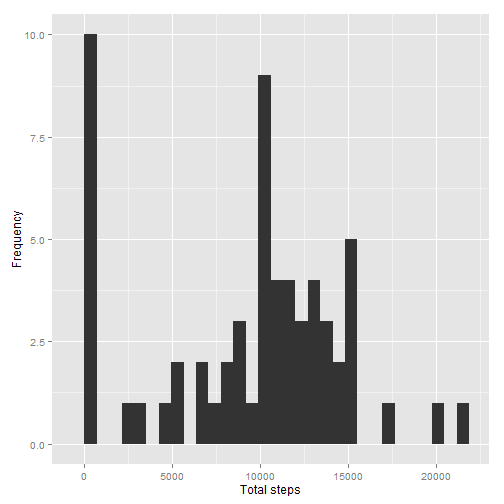
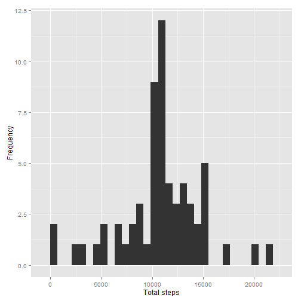

Reproducible Research: Peer Assessment 1
==========================================
Created by Benjamin Berhault on July 19, 2015


## Loading and preprocessing the data

If the CSV wasn't extract it will do so to read in the data.

```r
if(!file.exists('activity.csv')){
    unzip('activity.zip')
}
activity <- read.csv('activity.csv')
knitr::kable(summary(activity))
```


|   |    steps      |        date     |   interval    |
|:--|:--------------|:----------------|:--------------|
|   |Min.   :  0.00 |2012-10-01:  288 |Min.   :   0.0 |
|   |1st Qu.:  0.00 |2012-10-02:  288 |1st Qu.: 588.8 |
|   |Median :  0.00 |2012-10-03:  288 |Median :1177.5 |
|   |Mean   : 37.38 |2012-10-04:  288 |Mean   :1177.5 |
|   |3rd Qu.: 12.00 |2012-10-05:  288 |3rd Qu.:1766.2 |
|   |Max.   :806.00 |2012-10-06:  288 |Max.   :2355.0 |
|   |NA's   :2304   |(Other)   :15840 |NA             |
Last date :

```r
tail(activity$date, n=1)
```

[1] 2012-11-30
61 Levels: 2012-10-01 2012-10-02 2012-10-03 2012-10-04 ... 2012-11-30

Create a date.time column that combines the date and interval columns.

```r
# one hour is set as 100 it doesn't exist 60 or 65...
# e.g. you will have those records time : ...50  55 100 105...
# function below convert time : 0 5 10 15 into : 0.00 0.05 0.10
time <- formatC(activity$interval / 100, 2, format='f') 

# "0.00 0.05 0.10" to "2012-10-01 00:00:00 GMT" "2012-10-01 00:05:00 GMT" "2012-10-01 00:10:00 GMT"
activity$date.time <- as.POSIXct(paste(activity$date, time),
                                 format='%Y-%m-%d %H.%M',
                                 tz='GMT')
```

For analyzing the means at the different times of day, it will also be convenient to have a time column. To do this, I convert all of the dates to be for today. since we only care about the time for that column, it will help us with the analysis.

```r
activity$time <- format(activity$date.time, format='%H:%M:%S')
activity$time <- as.POSIXct(activity$time, format = "%H:%M:%S")
```

## What is mean total number of steps taken per day?

It is the average number of steps measure for one day, so we don't care NAs values there. 

First, calculate the mean number of steps for each day:

```r
total.steps <- tapply(activity$steps, activity$date, sum, na.rm=TRUE)
```

Mean and median for the total steps per day:

```r
mean(total.steps)
```

[1] 9354.23

```r
median(total.steps)
```

[1] 10395

Distribution of total number of steps per day with a histogram:

```r
qplot(total.steps, xlab='Total steps', ylab='Frequency') 
```

```
## stat_bin: binwidth defaulted to range/30. Use 'binwidth = x' to adjust this.
```

 
## What is the average daily activity pattern?

Calculate the mean steps for each five minute interval, and then put it in a data frame.

```r
mean.steps <- tapply(activity$steps, activity$time, mean, na.rm=TRUE)
daily.pattern <- data.frame(time=as.POSIXct(names(mean.steps)),
                            mean.steps=mean.steps)
```

Time series plot for the mean steps.

```r
pkgTest("scales")
ggplot(daily.pattern, aes(time, mean.steps)) + 
    geom_line() +
    xlab('Time of day') +
    ylab('Mean number of steps') +
    scale_x_datetime(labels=date_format(format='%H:%M'))
```

 

Which five minute interval has the highest mean number of steps?

```r
most <- which.max(daily.pattern$mean.steps)
format(daily.pattern[most,'time'], format='%H:%M')
```

[1] "08:35"


## Imputing missing values
Identify the number of intervals with missing step counts ("NA's"):

```r
summary(activity$steps)
```

   Min. 1st Qu.  Median    Mean 3rd Qu.    Max.    NA's 
   0.00    0.00    0.00   37.38   12.00  806.00    2304 

To fill in the missing values, I'll use mean steps for a five-minute interval for the entire dataset.

```r
pkgTest("Hmisc")
# impute {Hmisc} : http://www.inside-r.org/packages/cran/Hmisc/docs/impute
# The simple imputation method involves filling in NAs with constants, with a specified single-valued function of the non-NAs, or from a sample (with replacement) from the non-NA values (this is useful in multiple imputation). 
activity.imputed <- activity
activity.imputed$steps <- with(activity.imputed, impute(steps, mean))
```

Let's compare the mean and median steps for each day between the original data set and the imputed data set.

```r
total.steps.imputed <- tapply(activity.imputed$steps, 
                              activity.imputed$date, sum)
mean(total.steps)
```

[1] 9354.23

```r
mean(total.steps.imputed)
```

[1] 10766.19

```r
median(total.steps)
```

[1] 10395

```r
median(total.steps.imputed)
```

[1] 10766.19

And a histogram of the imputed dataset.

```r
qplot(total.steps.imputed, xlab='Total steps', ylab='Frequency')
```

```
## stat_bin: binwidth defaulted to range/30. Use 'binwidth = x' to adjust this.
```

 

Imputing the missing data has increased the average number of steps. 

### Are there differences in activity patterns between weekdays and weekends?

1. Create a new factor variable in the dataset with two levels - "weekday" and "weekend" indicating whether a given date is a weekday or weekend day.


```r
activity.imputed$dateType <-  ifelse(as.POSIXlt(activity.imputed$date)$wday %in% c(0,6), 'weekend', 'weekday')
```

2. Make a panel plot containing a time series plot

```r
averagedActivityDataImputed <- aggregate(steps ~ interval + dateType, data=activity.imputed, mean)
ggplot(averagedActivityDataImputed, aes(interval, steps)) + 
    geom_line() + 
    facet_grid(dateType ~ .) +
    xlab("5-minute interval") + 
    ylab("avarage number of steps")
```

 
